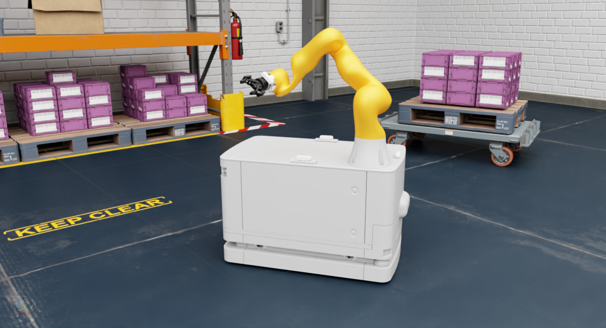

# Isaac sim extensions

This is a repo containing extensions created for NVIDIA Isaac sim for my [master's thesis](https://ntnuopen.ntnu.no/ntnu-xmlui/handle/11250/3066527) at NTNU. 

The thesis mainly concerns a KUKA KMR iiwa which is present at the MANULAB at NTNU in Trondheim.

## Extensions
The extensions are located under the [`exts`](./exts/) directory

### KMR Loader
The [KMR Loader extension](./exts/omni.isaac.kmr_loader/) loades the KUKA KMR iiwa into a stage and initializes ROS interfaces necessary for controlling the robot. Detailed information for the extension can be found in the [readme](./exts/omni.isaac.kmr_loader/docs/README.md)

### Pose Logger
The [Pose Logger extension](./exts/omni.isaac.pose_logger/) is a utility extension developed for logging data when conducting experiments on the KMR. The extension gather data about position in realtion to the world frame and joint angles and velocities and stores it as json data. Detailed information can be found in the [readme](./exts/omni.isaac.pose_logger/docs/README.md)

## Data processing
The repository also contains data gathered from the experiments. This is located in the [`data_processing`](./data_processing/) directory. A separate [readme](./data_processing/README.md) describes the data.
